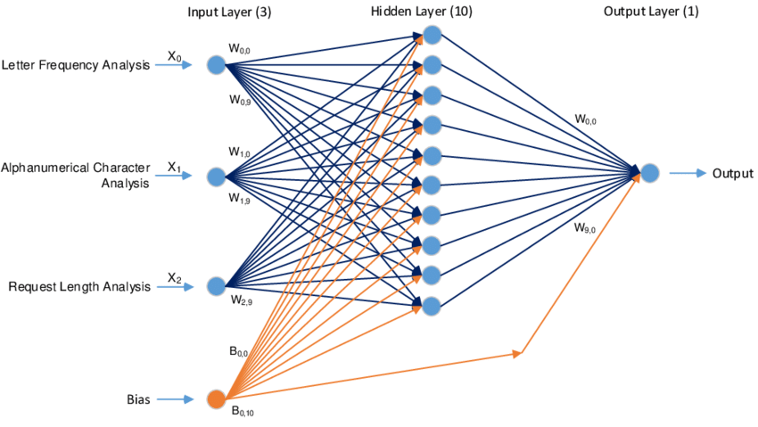

# Neural_Network_Charity_Analysis

# Introduction 
Neural network better known as artificial networks are the heart of deep learning as we know it, they try to imitate the brain functionality. Like the human brain the neural networks are made of "neurons", in this structure weights are assigned into each variable to be able to understand the importance affecting the output, all the inputs are then multiplied by their respective weights and summed, then the output is passed trough a activation function, if the value is bigger than the treshold the values are passed to the next layer or the final output.

fig 1. model of the neural network (Terek & Faruk-Bay 2019)

That´s a quick explanation of how neural networks work but there is a lot of math behind them, we are going to focus on the easy part. Today neural network is a must have skills in a lot of different fields, from medicine social media. We are trying to create a neural network to predict if a donation will be made to different charities. To start with the variables the name of the charity and the employer identification number where not necessary so they where dropped, after that application_type and ask_amt had 17 and 71 unique values adding noise to the model so the solution taken was to bag the uncommon values into "others", to be able to work with the categorical data a hot encoder was applied with a total of 42 new columns being merged into the dataframe. 
After processing the dataframe, the independent variables where selected as X and the dependent variable y ("Is Succesfull"), split into training and testing data and standarized to avoid outlier data, a Sequential model from Keras was used, the first model had 3 layers, the input, a hidden layer and the output, the input used a Relu activation with 20 neurons, the hidden layer had 10 neurons and ReLU activation again and the output layer had the sigmoid activation because the result was binary, also for this the model loss was binary_crossentropy, the adam optimizer was utilized and the metrics was accuracy.
Trying to get a better model there where 3 different methodologies, the first one was creating a function to create multpiple models with different parameters, the secodn one was a model with different hidden layers and more epochs and lastly the tunner option from keras tunner

# Results
The resulting model had a 73% accuracy, this is really low and getting almost at the point of being a random coss toin, so a model optimization was an order, although better results where expected and I would love to tell you that I got it, it didn´t got any better, with the tunner optimization a 4 hours model was made and got a 73% score again, the other 2 methods didn´t got something better with 72%

Fig 2. tunner image
